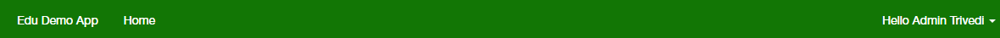

# Basic SSO - Angular/Node version

In this sample we show you how to integrate Azure Active Directory(Azure AD) to provide secure sign in and authorization. 

The code in the following sections is part of the full featured Angular app and presented as a new project for clarity and separation of functionality.

**Table of contents**
* [Register the application in Azure Active Directory](#register-the-application-in-azure-active-directory)
* [Prerequisites](#prerequisites)
* [Build and debug locally](#build-and-debug-locally)


## Build and deploy the Starter Project

Visual Studio 2015 is used as editor.

The starter project is a simple application with only SQL authentication configured. By updating this project, you can see how to integrate O365 Single Sign On to an application with existing authentication.

1. Open Visual Studio 2015 as administrator, open the project under Starter Project folder. The starter project you can register a new user, login and then display a basic page with login user info.

2. Select **npm**, right-click and select **Install Missing npm Packages**.

   

3. Press **F5** to run the application.

4. In the opened page, click the Register link to register as a user.

   

5. Complete the form to add a user.

   

6. Once registered, you should see a blank page.

   

## Register the application in Azure Active Directory

1. Sign in to the Azure portal: [https://portal.azure.com/](https://portal.azure.com/).

2. Choose your Azure AD tenant by selecting your account in the top right corner of the page.


3. Click **Azure Active Directory** -> **App registrations** -> **+Add**.

4. Input a **Name**, and select **Web app / API** as **Application Type**.

   Input **Sign-on URL**: https://localhost:44377/

   

   Click **Create**.

5. Once completed, the app will show in the list.

   

6. Click it to view its details. 

   

7. Click **All settings**, if the setting window did not show.

     

     Copy aside **Application ID**, then Click **Save**.

   * Click **Reply URLs**, add the following URL into it.

     [https://localhost:44377/](https://localhost:44377)

     ​

   * Click **Required permissions**. Add the following permissions:

     | API                            | Application Permissions | Delegated Permissions         |
     | ------------------------------ | ----------------------- | ----------------------------- |
     | Windows Azure Active Directory |                         | Sign in and read user profile |

     

   * Click **Keys**, then add a new key

     

     Click **Save**, then copy aside the **VALUE** of the key. 

   Close the Settings window.


## Add Single Sign On

1. Open the Starter Project in Visual Studio 2015, if it isn't already open.

2. Right click the **EDUGraphAPI.Web** project and select **Properties**.  In Environment Variables input two keys **clientId** and **clientSecret**.

   

   **ClientId**: use the Client Id of the app registration you created earlier.

   **ClientSecret**: use the Key value of the app registration you created earlier.

3. Edit **app\login\login.component.template.html**, delete all code and add the following code into it.

   ```html
   <!-- Copyright (c) Microsoft Corporation. All rights reserved. Licensed under the MIT license. -->
   <!-- See LICENSE in the project root for license information -->
   <div class="loginbody">
       <div class="row">
           <div class="col-md-5">
               <section id="loginForm">
                   <form #form="ngForm" class="form-horizontal ng-untouched ng-pristine ng-valid">
                       <div class="validation-summary-valid text-danger">
                           <ul>
                               <li [hidden]="!email.errors?.email || (email.pristine && !form.submitted)">The Email field is not a valid e-mail address.</li>
                               <li [hidden]="!email.errors?.required || (email.pristine && !form.submitted)">The Email field is required.</li>
                               <li [hidden]="!password.errors?.minlength || (password.pristine && !form.submitted)">The Password must be at least 6 characters long.</li>
                               <li [hidden]="!password.errors?.maxlength || (password.pristine && !form.submitted)">The Password must be at most 100 characters long.</li>
                               <li [hidden]="!password.errors?.required || (password.pristine && !form.submitted)">The Password field is required.</li>
                               <li [hidden]="!showLoginFailed">Your account or password is incorrect.  </li>
                           </ul>
                       </div>
                       <h4 class="margin-btm-20">Use your local account to log in.</h4>
                       <div class="form-group">
                           <div class="col-md-12">
                               <input [(ngModel)]="model.email" #email="ngModel" class="form-control logincontrol" id="Email" name="Email" placeholder="Email" email required>
                           </div>
                       </div>
                       <div class="form-group">
                           <div class="col-md-12">
                               <input [(ngModel)]="model.password" #password="ngModel" class="form-control logincontrol" id="Password" name="Password" placeholder="password" type="password" minlength="6" maxlength="100" required>
                           </div>
                       </div>
                       <div class="form-group">
                           <div class="margin-left-20 col-md-10">
                               <div class="checkbox">
                                   <input data-val="true" data-val-required="The Remember me? field is required." id="RememberMe" name="RememberMe" type="checkbox" [(ngModel)]="model.remember"><input name="RememberMe" type="hidden" value="false">
                                   <label for="RememberMe">Remember me?</label>
                               </div>
                           </div>
                       </div>
                       <div class="form-group">
                           <div class="col-md-10">
                               <input type="button" class="btn btn-default btn-local-login" value="Sign in" [disabled]="!form.valid || form.pristine" (click)="localLogin()">
                           </div>
                       </div>
                   </form>
                   <p>
                       <a href="javascript:void(0)" (click)="gotoRegister()">Register as a new user</a>
                   </p>
               </section>
           </div>
           <div class="col-md-5">
               <section id="socialLoginForm">
                   <h4 class="margin-btm-20">Use your school account</h4>
                   <div id="socialLoginList">
                       <p>
                           <button type="submit" class="btn btn-default btn-ms-login" id="OpenIdConnect" name="provider" value="OpenIdConnect" title="Log in using your Microsoft Work or school account" (click)="login()"></button>
                       </p>
                   </div>
               </section>
           </div>
       </div>
   </div>
   ```

   A new login to O365 button is added on this page. When login to O365 is clicked, it will redirect the page to O365 login page.

   To see how this file works in the Demo app, refer to the file located [here](../src/EDUGraphAPI.Web/app/login/login.component.template.html) in the Demo app.

4. Edit **app\login\login.component.ts**, delete all code and add the following code into it.

   ```typescript
   /*
   * Copyright (c) Microsoft Corporation. All rights reserved. Licensed under the MIT license.
   * See LICENSE in the project root for license information.
   */
   import { Component, OnInit, OnDestroy, ViewEncapsulation } from '@angular/core';
   import { Router, NavigationEnd, ActivatedRoute } from '@angular/router';
   import { Inject } from '@angular/core';
   import 'rxjs/add/operator/filter';
   import 'rxjs/add/operator/map';
   import 'rxjs/add/operator/mergeMap';
   import { UserInfo } from '../models/common/userInfo'
   import { AuthHelper } from "../authHelper/authHelper";
   import { UserService } from "../services/userService";
   import { MeService } from "../services/meService";

   @Component({
       encapsulation: ViewEncapsulation.None,
       moduleId: module.id,
       selector: 'loginform',
       templateUrl: 'login.component.template.html',
       styles: [`
           .containerbg{height:100%;}
           .container{width:100% !important;}
           .container.body-content{height :100% !important;}
           .body-content{background-image:url('/app/Images/longin-bg.jpg') ; background-size:cover; margin:0;width:100%;}
           .container>div.row{background-color:transparent;}
           .loginbody{margin:auto;padding:110px 15px 0 15px;max-width:1200px;}
           .loginbody > .row{padding:0 20px 0 65px;}
           .btn-ms-login{border:none;background-color:transparent;background-image:url('/app/Images/SignInWithOffice365-Button.png');width:234px;height:40px;}
           .margin-btm-20{margin-bottom:20px;}
           .margin-left-20{margin-left:20px;}
           .rememberme{margin-left:20px;}
           .btn-local-login{margin: 20px 0 5px 0;text-transform:uppercase;background-color:#237e17;color:white;width:95px;height:33px;text-align:center; font-size:16px;}
           .form-group{margin-bottom:20px;}
           .form-control{border-radius:5px;border:1px solid #acacac;font-size:16px;}
           ::-moz-placeholder { color: #f3f3f3 !important; font-style:italic; }
           ::-webkit-input-placeholder { color:#f3f3f3 !important;font-style:italic; }
           :-ms-input-placeholder { color:#f3f3f3 !important; font-style:italic;}
           .registerlink,.registerlink:hover{color:#4b67f8;font-size:16px;}
           h4{color:#000000;font-size:16px;}
           input::-webkit-input-placeholder, input::-moz-placeholder, input:-ms-input-placeholder, input:-moz-placeholder {
              font-family:'Helvetica Neue LT Std It';
              color:#f3f3f3;
           }
           .navbar-right, .navbar-nav{display:none;}
           #loginForm a{color:#4B67F8;font-size:16px;}
           .logincontrol{width:380px !important;height:36px;max-width:380px;}
           .loginbody .row .col-md-5:nth-child(2){margin-left:85px;}
           .loginbody .row .col-md-5:nth-child(1){margin-left:75px;}
           .container > .navbar-header, .container > .navbar-collapse {width: 1120px!important; margin:auto auto; float:none;}
       `]
   })

   export class Login implements OnInit {

       model: UserInfo = new UserInfo();
       showLoginFailed: boolean = false;

       constructor(
           private router: Router,
           private activatedRoute: ActivatedRoute,
           @Inject('auth') private auth: AuthHelper,
           @Inject('me') private meService: MeService,
           @Inject('user') private userService: UserService) {
           this.model.email = "";
           this.model.password = "";
           this.model.remember = false;
       }

       ngOnInit() {
           this.router.events
               .filter(event => event instanceof NavigationEnd)
               .map(() => this.activatedRoute)
               .map(route => {
                   while (route.firstChild) route = route.firstChild;
                   return route;
               })
               .filter(route => route.outlet === 'primary')
               .mergeMap(route => route.data)
               .subscribe((event) => {
                   if (this.auth.IsLogin()) {
                       window.location.href = "/schools";
                   }
                   else {
                       if (this.router.url != "/register") {
                           this.router.navigate(['login']);
                       } else {
                           this.router.navigate(['register']);
                       }
                   }
               });
       }
 


       localLogin() {
           this.userService.localLogin(this.model)
               .then((result) => {
                   if (result.status == "200") {
                       this.meService.getCurrentUser()
                           .subscribe((user) => {
                               window.location.href = "/schools";
                           });
    
                   } else {
                       this.showLoginFailed = true;
                   }
               })
               .catch((erro) => {
                   this.showLoginFailed = true;
               });
       }
    
       gotoRegister() {
           window.location.href = "/register";
       }
    
       login() {
           this.auth.login();
       }
   }
   ```

   New login method is added to call login method in auth helper class. 

   To see how this file works in the Demo app, refer to the file located [here](../src/EDUGraphAPI.Web/app/login/login.component.ts) in the Demo app.

5. Edit **app\authHelper\authHelper.ts**, remove all code and paste the following.

   ```typescript
   import { Injectable, Inject } from "@angular/core";
   import { Constants } from '../constants';
   import { Cookie } from '../services/cookieService';
   import { Http, Headers, Response } from '@angular/http';
   import { MapUtils, JsonProperty } from '../utils/jsonhelper'
   import { Router, NavigationEnd, ActivatedRoute } from '@angular/router';
   import { Observable, ReplaySubject } from 'rxjs/Rx';

   @Injectable()
   export class AuthHelper {

       constructor(
           private router: Router,
           private _http: Http) {
       }

       public IsLogin(): boolean {
           var token = Cookie.get(Constants.AuthType);
           return token && token != "undefined";
       }

       public reLogin() {
           Cookie.delete(Constants.AuthType);
           this.router.navigate(['login']);
       }
       login() {
           window.location.href = "/auth/login/o365";
       }
   }
   ```

   New login method is added to redirect user to O365 site for login.

   To see how this file works in the Demo app, refer to the file located [here](../src/EDUGraphAPI.Web/app/authHelper/authHelper.ts) in the Demo app.

6. Edit **auth\appAuth.ts**, remove all code and paste the following.

   ```typescript
   /*
   * Copyright (c) Microsoft Corporation. All rights reserved. Licensed under the MIT license.
   * See LICENSE in the project root for license information.
   */
   var express = require("express");
   var passport = require("passport");
   import https = require('https');
   import { TokenCacheService } from '../services/tokenCacheService';
   import { Constants } from '../constants';
   import { UserService } from '../services/userService';

   var tokenCache = new TokenCacheService();

   export class appAuth {
       private app: any = null;

       //AAD authentication strategy
       private OIDCStrategy = require('../node_modules/passport-azure-ad/lib/index').OIDCStrategy;

       //Local authentication strategy
       private LocalStrategy = require('passport-local').Strategy;
   


       /******************************************************************************
       * Set up passport in the app
       ******************************************************************************/
       //-----------------------------------------------------------------------------
       // To support persistent login sessions, Passport needs to be able to
       // serialize users into and deserialize users out of the session.  Typically,
       // this will be as simple as storing the user ID when serializing, and finding
       // the user by ID when deserializing.
       //-----------------------------------------------------------------------------
       constructor(app: any) {
           this.app = app;
    
           passport.serializeUser(function (user, done) {
               done(null, user);
           });
    
           passport.deserializeUser(function (user, done) {
               done(null, user);
           });


           passport.use('Local', this.constructLocalStrategy());
           passport.use('O365', this.constructOIDCStrategy());
       }
    
       //-----------------------------------------------------------------------------
       // Use the OIDCStrategy within Passport.
       // 
       // Strategies in passport require a `verify` function, which accepts credentials
       // (in this case, the `oid` claim in id_token), and invoke a callback to find
       // the corresponding user object.
       // 
       // The following are the accepted prototypes for the `verify` function
       // (1) function(iss, sub, done)
       // (2) function(iss, sub, profile, done)
       // (3) function(iss, sub, profile, access_token, refresh_token, done)
       // (4) function(iss, sub, profile, access_token, refresh_token, params, done)
       // (5) function(iss, sub, profile, jwtClaims, access_token, refresh_token, params, done)
       // (6) prototype (1)-(5) with an additional `req` parameter as the first parameter
       //
       // To do prototype (6), passReqToCallback must be set to true in the config.
       //-----------------------------------------------------------------------------
       constructOIDCStrategy() {
           return new this.OIDCStrategy({
               identityMetadata: Constants.IdentityMetadata,
               clientID: Constants.ClientId,
               responseType: 'code',
               responseMode: 'form_post',
               redirectUrl: this.app.get('env') === 'development'
                   ? 'https://localhost:44380/auth/openid/return'
                   : 'https://' + Constants.Host + '/auth/openid/return',
               allowHttpForRedirectUrl: true,
               clientSecret: Constants.ClientSecret,
               validateIssuer: false,
               isB2C: false,
               passReqToCallback: true,
               loggingLevel: 'info',
               nonceLifetime: null,
           }, function (req, iss, sub, profile, jwtClaims, access_token, refresh_token, params, done) {
               if (!profile.oid) {
                   return done(new Error("No oid found"), null);
               }
               profile.tid = profile._json.tid;
               profile.authType = 'O365';
               req.res.cookie('authType', 'O365');
    
               var tokenCacheService = new TokenCacheService();
               tokenCacheService.createOrUpdate(profile.oid, Constants.AADGraphResource, {
                   refreshToken: refresh_token,
                   accessToken: access_token,
                   expiresOn: new Date(parseInt(params.expires_on) * 1000)
               }).then(item => {
                   done(null, profile);
               });
           });
       }
       //-----------------------------------------------------------------------------
       // Use the LocalStrategy within Passport.
       //-----------------------------------------------------------------------------
       constructLocalStrategy() {
           return new this.LocalStrategy(
               {
                   usernameField: 'email',
                   passwordField: 'password'
               },
               function (username, password, done) {
                   let userSrv = new UserService();
                   userSrv.validUser(username, password)
                       .then((user) => {
                           if (user) {
                               let organization = user['organization'];
                               done(null, {
                                   'id': user['id'],
                                   'oid': user['o365UserId'],
                                   'tid': organization ? organization.tenantId : '',
                                   'authType': "Local"
                               });
                           } else {
                               done(null);
                           }
                       })
                       .catch(err => {
                           done(null);
                       });
               });
       }
    
       ensureAuthenticated(req, res, next) {
           if (req.isAuthenticated()) {
               return next();
           }
           else if (req.baseUrl.startsWith("/api/")) {
               res.send(401, 'missing authorization header');
           }
           res.redirect('/');
       }
    
       // Initialize Passport!  Also use passport.session() middleware, to support
       // persistent login sessions (recommended).
       public initPassport(app: any) {
           app.use(passport.initialize());
           app.use(passport.session());
       }
    
       //-----------------------------------------------------------------------------
       // Set up the route controller
       //
       // 1. For 'login' route and 'returnURL' route, use `passport.authenticate`. 
       // This way the passport middleware can redirect the user to login page, receive
       // id_token etc from returnURL.
       //
       // 2. For the routes you want to check if user is already logged in, use 
       // `ensureAuthenticated`. It checks if there is an user stored in session, if not
       // it will call `passport.authenticate` to ask for user to log in.
       //-----------------------------------------------------------------------------
       public initAuthRoute(app: any) {
    
           app.post('/auth/login/local', passport.authenticate('Local'),
               function (req, res) {
                   if (req.body.remember) {
                       res.cookie('authType', 'Local', { maxAge: 30 * 24 * 60 * 60 * 1000 });
                   } else {
                       res.cookie('authType', 'Local');
                   }
                   res.json({ status: 'validate successfully' });
               });
    
           app.get('/auth/login/o365', function (req, res, next) {
               var email = req.cookies[Constants.O365Email];
               passport.authenticate('O365', {
                   resourceURL: Constants.AADGraphResource,
                   customState: 'my_state',
                   failureRedirect: '/',
                   login_hint: email
               })(req, res, next);
           });
    
           // 'GET returnURL'
           // `passport.authenticate` will try to authenticate the content returned in
           // query (such as authorization code). If authentication fails, user will be
           // redirected to '/' (home page); otherwise, it passes to the next middleware.
           app.get('/auth/openid/return', passport.authenticate('O365', { failureRedirect: '/' }), function (req, res) {
               res.redirect('/');
           });
    
           // 'POST returnURL'
           // `passport.authenticate` will try to authenticate the content returned in
           // body (such as authorization code). If authentication fails, user will be
           // redirected to '/' (home page); otherwise, it passes to the next middleware.
           app.post('/auth/openid/return', passport.authenticate('O365', { failureRedirect: '/' }), function (req, res) {
               res.redirect('/');
           });
    
           // 'logout' route, logout from passport, and destroy the session with AAD.
           app.get('/logout', function (req, res) {
               let authType = req.cookies['authType'];
               res.clearCookie('authType');
               req.logOut();
               req.session = null;
               res.redirect('/');
           });
       }
   }
   ```

   A new O365 login passport is setup on this class. It will setup parameters like client id, client secret, redirect URL. 

   To see how this file works in the Demo app, refer to the file located [here](../src/EDUGraphAPI.Web/auth/appAuth.ts) in the Demo app.

7. Edit **constants.ts** on root dictionary.  Remove all code and paste the following.

   ```typescript
   /*
   * Copyright (c) Microsoft Corporation. All rights reserved. Licensed under the MIT license.
   * See LICENSE in the project root for license information.
   */
   export class Constants {

       public static readonly Host: string = process.env.WEBSITE_HOSTNAME as string;

       public static readonly ClientId: string = process.env.clientId as string;
       public static readonly ClientSecret: string = process.env.clientSecret as string;

       public static readonly AADInstance: string = "https://login.microsoftonline.com/";
       public static readonly Authority: string = Constants.AADInstance + "common/";
       public static readonly IdentityMetadata: string = Constants.Authority + '.well-known/openid-configuration';

       public static readonly MSGraphResource: string = "https://graph.microsoft.com";
       public static readonly AADGraphResource: string = "https://graph.windows.net";

       public static readonly SourceCodeRepositoryUrl: string = process.env.sourceCodeRepositoryUrl as string;

       public static readonly AADCompanyAdminRoleName: string = "Company Administrator";

       // Cookie names
       public static readonly O365Username = "O365Username";
       public static readonly O365Email = "O365Email";

       // Database 
       public static readonly SQLiteDB: string = process.env.SQLiteDB as string;
   }

   export class O365ProductLicenses {
       /// <summary>
       /// Microsoft Classroom Preview
       /// </summary>
       public static readonly Classroom: string = "80f12768-d8d9-4e93-99a8-fa2464374d34";
       /// <summary>
       /// Office 365 Education for faculty
       /// </summary>
       public static readonly Faculty: string = "94763226-9b3c-4e75-a931-5c89701abe66";
       /// <summary>
       /// Office 365 Education for students
       /// </summary>
       public static readonly Student: string = "314c4481-f395-4525-be8b-2ec4bb1e9d91";
       /// <summary>
       /// Office 365 Education for faculty
       /// </summary>
       public static readonly FacultyPro: string = "78e66a63-337a-4a9a-8959-41c6654dfb56";
       /// <summary>
       /// Office 365 Education for students
       /// </summary>
       public static readonly StudentPro: string = "e82ae690-a2d5-4d76-8d30-7c6e01e6022e";
   }

   export class Roles {
       public static readonly Admin: string = "Admin";
       public static readonly Faculty: string = "Faculty";
       public static readonly Student: string = "Student";
   }
   ```

   This file defines constant parameter for login to O365.

   To see how this file works in the Demo app, refer to the file located [here](../src/EDUGraphAPI.Web/constants.ts) in the Demo app.

8. Edit **routes\me.ts**.  Remove all code and paste the following.

   ```typescript
   /*
   * Copyright (c) Microsoft Corporation. All rights reserved. Licensed under the MIT license.
   * See LICENSE in the project root for license information.
   */
   import express = require('express');
   import { UserService } from '../services/userService';

   var router = express.Router();
   var userService = new UserService();

   router.get('/', function (req, res) {
       var u = req.user;
       if (u.authType == 'O365') {
           var retUser;
           userService.getUserModel({ o365UserId: u.oid })
               .then(user => {
                   if (user == null) {
                       return userService.getO365User(u.oid, u._json.tid)
                           .then(user => {
                               user.authType = u.authType;
                               retUser = user;
                               return userService.validUserHasSameEmail(retUser.o365Email);
                           })
                           .then((ret) => {
                               retUser.hasSameNameLocalAccount = ret;
                               return retUser;
                           })
                   }
                   else {
                       user.areAccountsLinked = true;
                       user.authType = u.authType;
                       return user;
                   }
               })
               .then(usermodel => { res.json(usermodel); })
               .catch(error => res.json(500, { error: error }));
       }
       else {
           userService.getUserModel({ id: u.id })
               .then(user => {
                   user.authType = u.authType;
                   user.areAccountsLinked =
                       user.o365UserId != null && user.o365UserId != ''
                       && user.o365Email != null && user.o365Email != '';
                   res.json(user);
               })
               .catch(error => res.json(500, { error: error }));
       }
   })
 


   router.get('/accessToken', function (req, res) {
       if (!req.isAuthenticated()) {
           res.json(401, { error: "401 unauthorized" });
           return;
       }
    
       let userId = req.user.oid;
       if (userId == null) {
           res.json(null);
           return;
       }

   });

   export = router;
   ```

   New code is added to handle get user information from O365 when the current user is an O365 user.

   To see how this file works in the Demo app, refer to the file located [here](../src/EDUGraphAPI.Web/routes/me.ts) in the Demo app.

9. Add a new file **msGraphClient.ts** under root **services** folder. Remove all code and paste the following.

   ```typescript
   /*
   * Copyright (c) Microsoft Corporation. All rights reserved. Licensed under the MIT license.
   * See LICENSE in the project root for license information.
   */
   import * as request from 'superagent';
   import * as Promise from "bluebird";
   import { Constants, O365ProductLicenses, Roles } from '../constants';

   export class MSGraphClient {

       private accessToken: string;

       constructor(accessToken: string) {
           this.accessToken = accessToken;
       }

       public getO365User(tenantId: string): Promise<any> {
           let o365UserInfo = {
               user: null,
               roles: [],
               organization: null
           };
           return this.getMe()
               .then((user) => {
                   o365UserInfo.user = user
                   return this.getRoles(user)
               })
               .then((roles) => {
                   o365UserInfo.roles = roles;
                   if (tenantId == null) {
                       o365UserInfo.organization = null;
                       return o365UserInfo;
                   }
                   return this.getOrganization(tenantId)
               })
               .then((org) => {
                   o365UserInfo.organization = org;
                   return o365UserInfo;
               })
       }

       public getMe(): Promise<any> {
           return new Promise((resolve, reject) => {
               request
                   .get(Constants.MSGraphResource + "/v1.0/me/?$select=id,givenName,surname,userPrincipalName,assignedLicenses")
                   .set('Authorization', 'Bearer ' + this.accessToken)
                   .end((err, res) => {
                       if (err) {
                           return reject(err)
                       }
                       resolve(res.body);
                   })
           })
       }

       public getOrganization(tenantID: string): Promise<any> {
           return new Promise((resolve, reject) => {
               request
                   .get(Constants.MSGraphResource + "/v1.0/organization/" + tenantID + "?$select=id,displayName")
                   .set('Authorization', 'Bearer ' + this.accessToken)
                   .end((err, res) => {
                       if (err) {
                           return reject(err)
                       }
                       resolve(res.body);
                   })
           });
       }

       private getDirectoryAdminRole(): Promise<any> {
           return new Promise((resolve, reject) => {
               request
                   .get(Constants.MSGraphResource + "/v1.0/directoryRoles/" + "?$expand=members")
                   .set('Authorization', 'Bearer ' + this.accessToken)
                   .end((err, res) => {
                       if (err) {
                           return reject(err)
                       }
                       let directoryRole = res.body.value as Array<any>;
                       resolve(directoryRole.find(dr => dr.displayName == Constants.AADCompanyAdminRoleName));
                   })
           })
       }

       private getRoles(user: any): Promise<string[]> {
           let roles: string[] = [];
           return this.getDirectoryAdminRole()
               .then((directoryAdminRole) => {
                   if (directoryAdminRole.members.findIndex(i => i.id == user.id) != -1) {
                       roles.push(Roles.Admin);
                   }
                   if (user.assignedLicenses.findIndex(i => i.skuId == O365ProductLicenses.Faculty || i.skuId == O365ProductLicenses.FacultyPro) != -1)
                       roles.push(Roles.Faculty);
                   if (user.assignedLicenses.findIndex(i => i.skuId == O365ProductLicenses.Student || i.skuId == O365ProductLicenses.StudentPro) != -1)
                       roles.push(Roles.Student);
                   return roles;
               })
       }
   }
   ```

   This class is used to get user information from O365 with access token. 

   To see how this file works in the Demo app, refer to the file located [here](../src/EDUGraphAPI.Web/services/msGraphClient.ts) in the Demo app.

10. Edit **services\userService.ts**.  Remove all code and paste the following.

   ```typescript
	   /*
	   * Copyright (c) Microsoft Corporation. All rights reserved. Licensed under the MIT license.
	   * See LICENSE in the project root for license information.
	   */
	   import * as uuid from "node-uuid";
	   import * as Promise from "bluebird";
	   import * as bcrypt from 'bcryptjs';
	   import { DbContext, UserInstance } from '../data/dbContext';
	   import { TokenCacheService } from '../services/TokenCacheService';
	   import { MSGraphClient } from "../services/msGraphClient";
	   import { AuthenticationHelper } from '../utils/authenticationHelper';
	   import { Roles } from '../constants';
	   import { Constants } from '../constants';

	   export class UserService {

		   private dbContext = new DbContext();

		   public creatUser(email: string, password: string, firstName: string, lastName: string, favoriteColor: string): Promise<UserInstance> {
			   email = email.toLowerCase();
			   return this.dbContext.User
				   .findOne({ where: { email: email } })
				   .then(user => {
					   if (user == null) {
						   let passwordSalt = bcrypt.genSaltSync();
						   let passwordHash = password != null
							   ? bcrypt.hashSync(password, passwordSalt)
							   : null;
						   return this.dbContext.User.create(
							   {
								   id: uuid.v4(),
								   email: email,
								   firstName: firstName,
								   lastName: lastName,
								   passwordHash: passwordHash,
								   salt: passwordSalt,
								   favoriteColor: favoriteColor
							   });
					   }
					   else
						   throw (`Email ${email} is used by others`);

				   });
		   }

		   public validUser(email: string, password: string): Promise<any> {
			   email = email.toLowerCase();
			   let retUser;
			   return this.dbContext.User
				   .findOne({ where: { email: email } })
				   .then((user) => {
					   let isValid = user != null && bcrypt.hashSync(password, user.salt) == user.passwordHash;
					   if (isValid) {
						   retUser = user;
						   return user;
					   }
					   else
						   throw 'Invalid Username or password';
				   })
				   .then((user: UserInstance) => {
					   return user.getOrganization();
				   })
				   .then((organization) => {
					   if (organization != null)
						   retUser.organization = {
							   tenantId: organization.tenantId,
							   name: organization.name,
							   isAdminConsented: organization.isAdminConsented
						   };

					   return retUser;
				   })
		   }
	 


		   public validUserHasSameEmail(email: string): Promise<boolean> {
			   email = email.toLowerCase();
			   return this.dbContext.User
				   .findOne({ where: { email: email } })
				   .then(user => {
					   return user != null;
				   });
		   }


		   public getUserModel(where: any): Promise<any> {
			   return this.dbContext.User.findOne({ where: where })
				   .then(user => {
					   if (user == null) {
						   return null;
					   }
					   var result = {
						   id: user.id,
						   firstName: user.firstName,
						   lastName: user.lastName,
						   email: user.email,
						   o365UserId: user.o365UserId,
						   o365Email: user.o365Email,
						   favoriteColor: user.favoriteColor,
						   organization: null,
						   roles: []
					   }
					   var p1 = user.getOrganization()
						   .then(organization => {
							   if (organization != null) {
								   result.organization = {
									   tenantId: organization.tenantId,
									   name: organization.name,
									   isAdminConsented: organization.isAdminConsented
								   }
							   }
						   });
					   var p2 = user.getUserRoles()
						   .then(userRoles => userRoles.forEach(i => result.roles.push(i.name)));
					   return Promise.all([p1, p2])
						   .then((ret) => {
							   return result;
						   })
				   });
		   }
		
		   public getO365User(o365UserId: string, tenantId: string): Promise<any> {
			   return AuthenticationHelper.getAccessToken(o365UserId, Constants.MSGraphResource)
				   .then((accessToken) => {
					   let msgraphClient: MSGraphClient = new MSGraphClient(accessToken.value);
					   return msgraphClient.getO365User(tenantId)
				   })
				   .then((o365UserInfo) => {
					   let userInfo = this.convertO365UserToLocal(o365UserInfo);
		
					   return userInfo;
		
				   })
		   }


		   private convertO365UserToLocal(o365UserInfo: any): any {
			   let userInfo = {
				   firstName: o365UserInfo.user.givenName,
				   lastName: o365UserInfo.user.surname,
				   o365UserId: o365UserInfo.user.id,
				   o365Email: o365UserInfo.user.mail == null ? o365UserInfo.user.userPrincipalName : o365UserInfo.user.mail,
				   organization: o365UserInfo.organization == null ? null : {
					   tenantId: o365UserInfo.organization.id,
					   name: o365UserInfo.organization.displayName
				   },
				   roles: o365UserInfo.roles
			   };
			   return userInfo
		   }
		   private getUserById(userId: string): Promise<UserInstance> {
			   return this.dbContext.User.findById(userId);
		   }
		
		   private getUserRoles(userId: string): Promise<any> {
			   return this.getUserById(userId)
				   .then((user) => {
					   return user.getUserRoles();
				   })
				   .then((roles) => {
					   let retRoles = [];
					   roles.forEach(i => retRoles.push(i.name));
					   return retRoles;
				   })
		   }
	   }
   ```

   New methods are added to get O365 user and convert O365 user to local user so O365 user can login.

   To see how this file works in the Demo app, refer to the file located [here](../src/EDUGraphAPI.Web/services/userService.ts) in the Demo app.

11. Create a new folder **utils** on root dictionary.  Add a new file **authenticationHelper.ts** inside **utils** folder. Remove all code and paste the following.

   ```typescript
		/*
		* Copyright (c) Microsoft Corporation. All rights reserved. Licensed under the MIT license.
		* See LICENSE in the project root for license information.
		*/
		import { Constants } from '../constants';
		import { DbContext, TokenCacheInstance, TokenCacheAttributes } from '../data/dbContext';
		import { TokenCacheService } from '../services/TokenCacheService';
		import * as Promise from "bluebird";

		var AuthenticationContext = require('adal-node').AuthenticationContext;

		export class AuthenticationHelper {

			static getAccessTokenByCode(userId: string, code: string, resource: string, redirectUrl: string): Promise<any> {
				return this.getTokenWithAuthorizationCode(code, resource, redirectUrl)
					.then(authResult => {
						var tokenCacheService = new TokenCacheService();
						return tokenCacheService.createOrUpdate(userId, resource, authResult)
							.thenReturn(authResult);
					});
			}

			static getAccessToken(userId: string, resource: string): Promise<any> {
				return this.getTokenCore(userId, resource)
			}

			private static getTokenCore(userId: string, resource: string): Promise<any> {
				var tokenCacheService = new TokenCacheService();
				return tokenCacheService.get(userId).then(tokenCache => {
					if (tokenCache != null) {
						var accessTokens = JSON.parse(tokenCache.accessTokens);
						var accessToken = accessTokens[resource];
						if (accessToken == undefined || new Date(accessToken.expiresOn).valueOf() < (Date.now() + 60 * 5 * 1000)) {
							return this.getTokenWithRefreshToken(tokenCache.refreshToken, resource)
								.then(result => {
									return tokenCacheService.update(tokenCache, resource, result)
								})
								.then(tokenCache => {
									return JSON.parse(tokenCache.accessTokens)[resource]
								});
						}
						else
							return accessToken;
					}
					else {
						throw "Could not get access token as there is no refresh token. Re-login is required.";
					}
				});
			}

			private static getTokenWithAuthorizationCode(code: string, resouce: string, redirectUrl: string): Promise<any> {
				var redirectUri = `https://${Constants.Host}/${redirectUrl}`;
				return new Promise((resolve, reject) => {
					var authenticationContext = new AuthenticationContext(Constants.Authority);
					authenticationContext.acquireTokenWithAuthorizationCode(
						code,
						redirectUri,
						resouce,
						Constants.ClientId,
						Constants.ClientSecret,
						function (err, response) {
							if (err) reject(err.message);
							else resolve(response);
						}
					);
				});
			}

			private static getTokenWithRefreshToken(refreshToken: string, resource: string): Promise<any> {
				return new Promise((resolve, reject) => {
					var authenticationContext = new AuthenticationContext(Constants.Authority);
					authenticationContext.acquireTokenWithRefreshToken(
						refreshToken,
						Constants.ClientId,
						Constants.ClientSecret,
						resource,
						function (err, response) {
							if (err) reject(err.message);
							else resolve(response);
						}
					);
				});
			}
		}
   ```

    This class is used to handle access token. 

    To see how this file works in the Demo app, refer to the file located [here](../src/EDUGraphAPI.Web/utils/authenticationHelper.ts) in the Demo app.

12. Deploy the application locally by pressing F5.

13. Click the **Sign in with Office 365** button and then login to O365.

    

14. After login with O365 user it will redirect to a basic page.

    


**Copyright (c) 2017 Microsoft. All rights reserved.**
