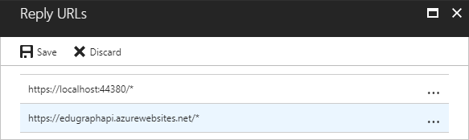
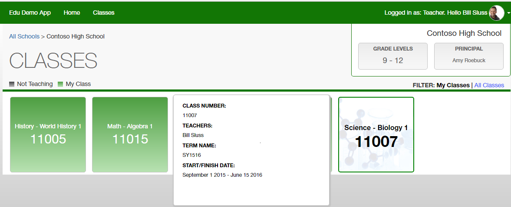

# EDUGraphAPI - Office 365 Education Code Sample#

## What is EDUGraphAPI?##

EDUGraphAPI is a sample that demonstrates:

* Linking locally-managed user accounts and Office 365 (Azure Active Directory) user accounts. 

  After linking accounts, users can use either local or Office 365 accounts to log into the sample web site and use it.

* Geting schools, sections, teachers, and students from Office 365 Education:

  * [Office 365 Schools REST API reference](https://msdn.microsoft.com/office/office365/api/school-rest-operations)

* Calling Graph APIs, including:

  - [Microsoft Graph API](https://www.nuget.org/packages/Microsoft.Graph/)
  - [Microsoft Azure Active Directory Graph API](https://www.nuget.org/packages/Microsoft.Azure.ActiveDirectory.GraphClient/)


EDUGraphAPI is based on NodeJS (the server side) and Angular 2 (the client side).

## How To: Configure your Development Environment

Download and install the following tools to run, build and/or develop this application locally.

- [Visual Studio 2015 Community](https://go.microsoft.com/fwlink/?LinkId=691978&clcid=0x409)
- [TypeScript for Visual Studio 2015](https://www.microsoft.com/en-us/download/details.aspx?id=48593)
- [Node.js Tools 1.2](http://aka.ms/ntvs1.2.RTW.2015)
- [Git](https://git-scm.com/download/win)

Ensure your Nodejs is v6.9.2 or above and NPM is v3.10.8 or above.

Configure Visual Studio to use the global external web tools instead of the tools that ship with Visual Studio.

* Open the Options dialog with **Tools | Options**.

* In the tree on the left, select **Projects and Solutions | External Web Tools**.

* On the right, move the `$(PATH)` entry above the `$(DevEnvDir)` entries. 

  > This tells Visual Studio to use the external tools (such as npm) found in the global path before using its own version of the external tools.

* Click **OK** to close the dialog.

* Restart Visual Studio for this change to take effect.

**GitHub Authorization**

1. Generate Token

   - Open https://github.com/settings/tokens in your web browser.
   - Sign into your GitHub account where you forked this repository.
   - Click **Generate Token**
   - Enter a value in the **Token description** text box
   - Select all the **check boxes**

   

   - Click **Generate token**
   - Copy the token

2. Add the GitHub Token to Azure in the Azure Resource Explorer

   - Open https://resources.azure.com/providers/Microsoft.Web/sourcecontrols/GitHub in your web browser.
   - Log in with your Azure account.
   - Selected the correct Azure subscription.
   - Select **Read/Write** mode.
   - Click **Edit**.
   - Paste the token into the **token parameter**.

   

   - Click **PUT**

**Create a key to use the Bing Maps**

1. Open [https://www.bingmapsportal.com/](https://www.bingmapsportal.com/) in your web browser and sign in.

2. Click  **My account** -> **My keys**.

3. Create a **Basic** key, select **Public website** as the application type.

4. Copy the **Key** and save it. 

   

   >**Note:** The key is used in a subsequent step.

**Create an Application in you AAD**

1. Sign into the traditional azure portal: [https://manage.windowsazure.com](https://manage.windowsazure.com).

2. Open the AAD where you plan to create the application.

3. Click **ADD** on the bottom bar.

   

4. Click **Add an application my organization is developing**.

   

5. Input a **Name**, and select **WEB APPLICATION AND/OR WEB API**. 

   

6. Click **➔**.


7. Enter the following values:

   * **SIGN-ON URL:** https://localhost:44380/

   * **APP ID URI:** https://<<YOUR TENANT>>/EDUGraphAPI

   >**Note**: A domain from your tenant must be used here, since this is a multi-tenant application.

   

8. Click the **✓**.

9. Click **CONFIGURE**.

   

10. Enable **APPLICATION IS MULTI-TENANT**.

   

11. Enable **USER ASSIGNMENT REQUIRED TO ACCESS APP**.

   

12. Configure the following **permissions to other applications**.

|                                | Application Permissions       | Delegated Permissions                    |
| ------------------------------ | ----------------------------- | ---------------------------------------- |
| Microsoft Graph                | Read all users' full profiles | Read all groups<br>Read directory data<br>Access directory as the signed in user<br>Sign user in |
| Windows Azure Active Directory | Read and write directory data | Sign in and read user profile<br>Read and write directory data |

12. In the keys section, click the dropdown list and select a duration, then click **Save**.

   

13. Copy aside the Client ID and the key value.

   


**Deploy the Azure Components**

1. Check to ensure that the build is passing VSTS Build

2. Fork this repository to your GitHub account

3. Click the Deploy to Azure Button

   [](https://portal.azure.com/#create/Microsoft.Template/uri/https%3a%2f%2fraw.githubusercontent.com%2fTylerLu%2fEDUGraphAPI2%2fmaster%2fazuredeploy.json)

4. Fill in the values in the deployment page and select the **I agree to the terms and conditions stated above** checkbox.

   

   * **Resource group**: we suggest you to Create a new group.

   * **Site Name**: please input a name. Like EDUGraphAPICanviz or EDUGraphAPI993.

     > Note: If the name you input is taken, you will get some validation errors:
     >
     > 
     >
     > Click it you will get more details, like storage account is already in other resource group/subscription.
     >
     > In this case, please use another name.

   * **Sql Administrator Login Password**: please DO use a strong password.

   * **Source Code Repository URL**: replace <YOUR REPOSITORY> with the repository name of your fork.

   * **Source Code Manual Integration**: choose **false**, since you are deploying from your own fork.

   * **Client Id**: use the Client Id of the AAD Application your created earlier.

   * **Client Secret**: use the Key value of the AAD Application your created earlier.

   * **Bing Map Key**: use the key of Bing Map you got earlier.

   * Check **I agree to the terms and conditions stated above**.

5. Click **Purchase**.

**Add REPLY URL to the AAD Application**

1. After the deployment, open the resource group:

   

2. Click the web app.

   

   Copy the URL aside and change the schema to **https**. This is the replay URL and will be used in next step.

3. Navigate to the AAD application in the traditional azure portal, then click the **Configure** tab.

   Add the reply URL:

   

4. Click **SAVE**.

**Debug the sample locally**

First you should configure the environment variables. 

For some OS (like Windows 10), you can configure them by right click the EDUGraphAPI.Web project and click **Properties**.


Below are all the environments variables used:

* **WEBSITE_HOSTNAME**: the host name of the app, used for the ADAL authentication. For local machine, please use the value: localhost:44380; On a azure website, it will be the default domain name.
* **Client Id**: use the Client Id of the AAD Application your created earlier.
* **Client Secret**: use the Key value of the AAD Application your created earlier.
* **Bing Map Key**: use the key of Bing Map you got earlier.
* **SQLServerHost**: the host name of the SQL Server.
* **SQLServerDatabase**: the database name of the SQL database.
* **SQLServerUsername**: the username of the SQL Server.
* **SQLServerPassword**: the password of the SQL user.
* **sourceCodeRepositoryUrl**: the repository URL,  used by the demo helper control. If you fork this repository, you can update it to point to you repository.

## Documentation

### Introduction

**Solution Component Diagram**


The top layer of the solution contains the two parts of the EDUGraphAPI.Web project:

* The server side Node.js app.
* The client side Angular 2 app.

The bottom layers contains the three data sources.

* The EDUGraphAPI database.
* Education data exposed by REST APIs.
* Azure AD data exposed by Graph APIs.

### **EDUGraphAPI.Web - Server**

The server side app is based on Node.js and implemented with Typescript.

**Authentications**

Passport and its 2 plugins are used to enable local and O365 authentications:

* **[passport-azure-ad](https://github.com/AzureAD/passport-azure-ad)**: a collection of [Passport](http://passportjs.org/) Strategies to help you integrate with Azure Active Directory. It includes OpenID Connect, WS-Federation, and SAML-P authentication and authorization. These providers let you integrate your Node app with Microsoft Azure AD so you can use its many features, including web single sign-on (WebSSO), Endpoint Protection with OAuth, and JWT token issuance and validation.
* **[passport-local](https://github.com/jaredhanson/passport-local)**: this module lets you authenticate using a username and password in your Node.js applications. By plugging into Passport, local authentication can be easily and unobtrusively integrated into any application or framework that supports [Connect](http://www.senchalabs.org/connect/)-style middleware, including [Express](http://expressjs.com/).

The 2 kinds of authentications are implemented in the **/auth/appAuth.ts** file.

**Web APIs**

The server app expose several Web APIs:

| Path                                  | Method   | Description                              |
| ------------------------------------- | -------- | ---------------------------------------- |
| /me                                   | GET      | Return the current user and the user's organization and roles |
| /me/favoriteColor                     | POST     | Update current user's favorite color     |
| /me/accesstoken                       | GET      | Get current user's access token          |
| /tenant                               | POST     | Update information (isAdminConsented) of current user's tenant |
| /tenant/unlinkAllUsers                | POST     | Unlink all users in current user's tenant |
| /users/linked                         | GET      | Get all linked users                     |
| /users/:userId/unlink                 | POST     | Unlink the specified u                   |
| /schools/seatingArrangements/:classId | GET/POST | Get or set the seating arrangement of the specified class |

These APIs are defined in the **/routes** folder.

**Data Access**

[Sequelize](http://docs.sequelizejs.com/en/v3/) is used in this sample to access data from a SQL Database. 

The **DbContext** is exposed the models and methods that used to access data.

Below are the tables used in this demo:

| Table                        | Description                              |
| ---------------------------- | ---------------------------------------- |
| Users                        | Contains the users information name, email, hased password...<br>*O365UserId* and *O365Email* are used to connect the local user with a O365 user. |
| UserRoles                    | Contains users' role. Three roles are used in this sample: admin, teacher and student. |
| Organizations                | A row in this table represents a tenant in AAD.<br>*IsAdminConsented* column records than if the tenant consented by an administrator. |
| TokenCache                   | Contains the users' access/refresh tokens. |
| ClassroomSeatingArrangements | Contains the classroom seating arrangements. |

You will find the **DbContext** class and related model interfaces in the **/data/dbContext.ts** file.

**Services**

Below are the services used by the server side app:

| Service           | Description                              |
| ----------------- | ---------------------------------------- |
| MSGraphClient     | Contains methods used to access MS Graph APIs |
| SchoolService     | Contains two methods: get/update seating arrangements |
| TenantService     | Contains methods that operate tenants in the database |
| TokenCacheService | Contains method used to get and update cache from the database |
| UserService       | Contains method used to manipulate users in the database |

The services are in the **/services** folder.

**Multi-tenant app**

This web application is a **multi-tenant app**. In the AAD, we enabled the option:


Users from any Azure Active Directory tenant can access this app. As this app uses some application permissions, an administrator of the tenant should sign up (consent) first. Otherwise, users would be an error:


For more information, see [Build a multi-tenant SaaS web application using Azure AD & OpenID Connect](https://azure.microsoft.com/en-us/resources/samples/active-directory-dotnet-webapp-multitenant-openidconnect/).

### **EDUGraphAPI.Web - Client**

The client side app which resides in the /app folder is based on Angular 2 and also implemented with Typescript 2.

> Note:  getting and using declaration files in TypeScript 2.0 becomes much easier. To get declarations for a library like lodash, all you need is npm:
>
> ```
> npm install --save @types/lodash
> ```

**Components**

Below are the components used in the client app.

| Folder      | Component             |
| ----------- | --------------------- |
| /           | App                   |
| /aboutme    | AboutMe               |
| /admin      | Admin                 |
|             | LinkedAccounts        |
| /demoHeoper | DemoHelper            |
| /header     | Header                |
| /link       | Link                  |
|             | LinkCreateLocal       |
|             | LinkLoginLocal        |
|             | LinkLoginO365Requried |
| /login      | Login                 |
| /register   | Register              |
| /schools    | Schools               |
|             | Classes               |
|             | MyClasses             |
|             | ClassDetails          |

**Services**

| Folder      | Name              |
| ----------- | ----------------- |
| /aboutme    | AboutMeService    |
| /admin      | AdminService      |
| /demoHelper | DemoHelperService |
| /services   | MeService         |
|             | UserService       |
|             | UserPhotoService  |
|             | DataService       |

### Office 365 Education API

[Office 365 Education APIs](https://msdn.microsoft.com/office/office365/api/school-rest-operations) help extract data from your Office 365 tenant which has been synced to the cloud by Microsoft School Data Sync. These results provide information about schools, sections, teachers, students and rosters. The Schools REST API provides access to school entities in Office 365 for Education tenants.

In the sample, the **Microsoft.Education** Class Library project was created to encapsulate Office 365 Education API. 

**EducationServiceClient** is the core class of the library. With it we can get education data easily.

**Get schools**

~~~typescript

~~~

~~~typescript

~~~

**Get sections**

~~~typescript

~~~

```typescript

```
```typescript

```
Below are some screenshots of the sample app that show the education data.





In **EducationServiceClient**, three private methods prefixed with HttpGet were created to simplify the invoking of REST APIs.

* **HttpGetAsync**: sends a http GET request to the target endpoint,  and returns the JSON response string.  An access token is included in the bearer authentication header.
* **HttpGetObjectAsync<T>**:  deserializes the JSON string returned by HttpGetAsync to the target type T, and return the result object.
* **HttpGetArrayAsync<T>**: deserializes the JSON string returned by HttpGetAsync to the target array type T[], and return the array. 


### Authentication Flows

There are 4 authentication flows in this project.

The first 2 flows (Local Login/O365 Login) enable users to login in with either a local account or an Office 365 account, then link to the other type account. This procedure is implemented in the LinkController.

**Local Login Authentication Flow**


**O365 Login Authentication Flow**


**Admin Login Authentication Flow**

This flow shows how an administrator logs into the system and performs administrative operations.

After logging into the app with an office 365 account,the administrator will be asked to link to local account. This step is not required and can be skipped. 

As we mentioned ealier, the web app is a mutli-tenant app which uses some application permissions, so an administrator of the tenant should consent the tenant first.  

This flow is implemented in AdminController. 


### Two Kinds of Graph API

There are two distinct Graph APIs used in this sample:

|              | [Azure AD Graph API](https://msdn.microsoft.com/en-us/library/azure/ad/graphInstall-Package) | [Microsoft Graph API](https://graph.microsoft.io/) |
| ------------ | ---------------------------------------- | ---------------------------------------- |
| Description  | The Azure Active Directory Graph API provides programmatic access to Azure Active Directory through REST API endpoints. Apps can use the Azure AD Graph API to perform create, read, update, and delete (CRUD) operations on directory data and directory objects, such as users, groups, and organizational contacts | A unified API that also includes APIs from other Microsoft services like Outlook, OneDrive, OneNote, Planner, and Office Graph, all accessed through a single endpoint with a single access token. |
| Client       | Install-Package [Microsoft.Azure.ActiveDirectory.GraphClient](https://www.nuget.org/packages/Microsoft.Azure.ActiveDirectory.GraphClient/) | Install-Package [Microsoft.Graph](https://www.nuget.org/packages/Microsoft.Graph/) |
| End Point    | https://graph.windows.net                | https://graph.microsoft.com              |
| API Explorer | https://graphexplorer.cloudapp.net/      | https://graph.microsoft.io/graph-explorer |

Microsoft are investing heavily in the new MS Graph API, and are not investing in the Azure AD Graph API any more (except fixing security issues).

So, please use he new MS Graph API as much as possible.

Below is a piece of code shows how to get "me" from the MS Graph API.

```typescript
public getMe(): Promise<any> {
    return new Promise((resolve, reject) => {
        request
            .get(Constants.MSGraphResource + "/v1.0/me/?$select=id,givenName,surname,userPrincipalName,assignedLicenses")
            .set('Authorization', 'Bearer ' + this.accessToken)
            .end((err, res) => {
                if (err) { return reject(err) }
                resolve(res.body);
            })
    })
}
```


Note that in AAD Application settings, permissions for each Graph API are configured separately:

 

## Contributors

| Roles                                    | Author(s)                                |
| ---------------------------------------- | ---------------------------------------- |
| Project Lead / Architect / Documentation | Todd Baginski (Microsoft MVP, Canviz Consulting) @tbag |
| PM                                       | John Trivedi (Canviz Consulting)         |
| Development Leader / Documentation       | Tyler Lu (Canviz Consulting) @TylerLu    |
| Developer (Education pages)              | Benny Zhang (Canviz Consulting)          |
| Developer (Authentications)              | Theodore Shi (Canviz Consulting)         |
| Developer (Link)                         | Albert Xie (Canviz Consulting)           |
| Developer (Web APIs)                     | Cloris Sun (Canviz Consulting)           |
| Developer (Education pages)              | Luis Lu (Canviz Consulting)              |
| Testing                                  | Ring Li (Canviz Consulting)              |
| Testing                                  | Cindy Yan (Canviz Consulting)            |
| UX Design                                | Justin So (Canviz Consulting)            |
| Code Reviews / Documentation             | Michael Sherman (Canviz Consulting) @canvizsherm |
| Sponsor / Support                        | TJ Vering (Microsoft) @TJVering          |
| Sponsor / Support                        | Alok Kumar Bansal (Microsoft)            |
| Sponsor / Support                        | Kaushik Barat (Microsoft) @kaubar        |
| Sponsor / Support                        | Kundana Palagiri (Microsoft)             |
| Sponsor / Support                        | Zion Brewer (Microsoft) @zckb            |

## Version history

| Version | Date         | Comments        |
| ------- | ------------ | --------------- |
| 1.0     | Nov 26, 2016 | Initial release |

## Disclaimer
**THIS CODE IS PROVIDED *AS IS* WITHOUT WARRANTY OF ANY KIND, EITHER EXPRESS OR IMPLIED, INCLUDING ANY IMPLIED WARRANTIES OF FITNESS FOR A PARTICULAR PURPOSE, MERCHANTABILITY, OR NON-INFRINGEMENT.**
